

    <h1>WynnTools</h1>
    <h4>The only WynnCraft Discord bot that uses images (That I have seen)</h4>

   
    
    
    
    

## Sections

- [Commands](#commands)
- [Change Log](#change-log)
- [Discord/Support](#discord)

### Commands

`< >` = Required arguments, `[ ]` = Optional arguments

#### General Commands

| Command               | Description                                                        | Syntax                                                               | Example                                                     | Response                                             |
| --------------------- | ------------------------------------------------------------------ | -------------------------------------------------------------------- | ----------------------------------------------------------- | ---------------------------------------------------- |
| about                 | Shows info about the bot.                                          | `/about`                                                             | `/about`                                                    | 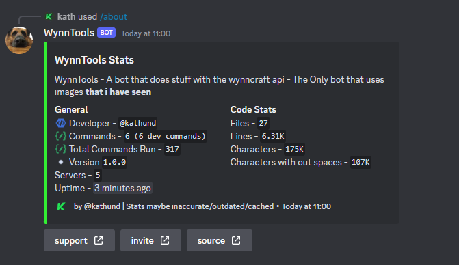             |
| fun-facts config      | Set the config for the fun facts in your server.                   | `/fun-facts config [channel] [role] [ghost-ping] [delete] [disable]` | `/fun-facts config`                                         | 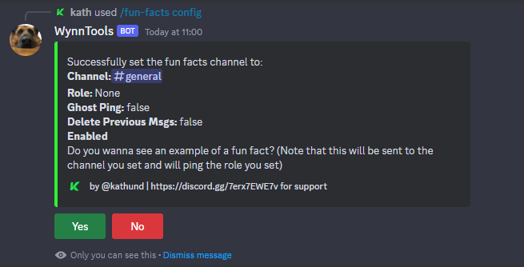     |
| fun-facts disable     | Disable the fun facts in your server.                              | `/fun-facts disable `                                                | `/fun-facts disable`                                        | 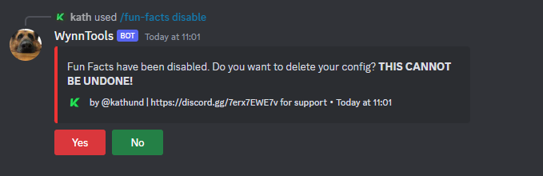    |
| fun-facts enable      | Enable the fun facts in your server (If you already have a config) | `/fun-facts enable `                                                 | `/fun-facts enable`                                         | 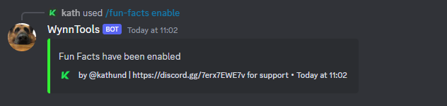     |
| fun-facts suggest     | Suggest a fun fact for daily fun facts.                            | `/fun-facts suggest <fact>`                                          | `/fun-facts suggest WynnCraft was released on29 April 2013` | 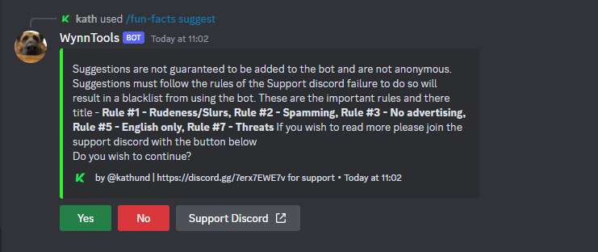    |
| fun-facts setup-guide | Fun Facts Setup Guide.                                             | `/fun-facts setup-guide `                                            | `/fun-facts setup-guide`                                    | 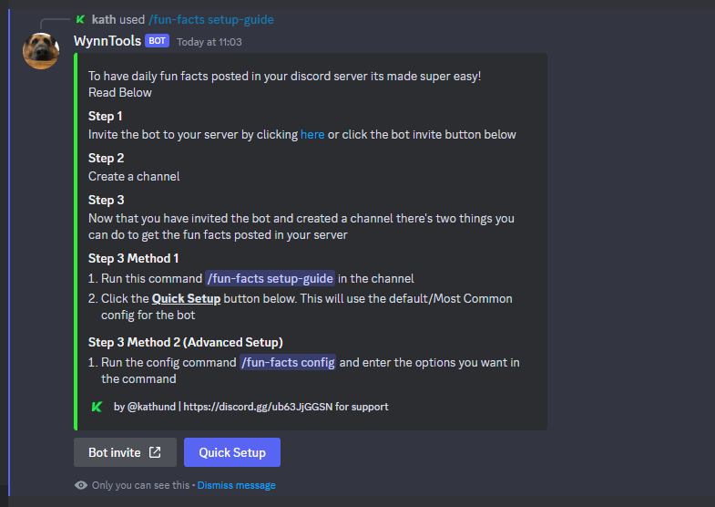 |
| guild                 | Displays the statistics of the specified guild.                    | `/guild <guild-name>`                                                | `/guild KongoBoys`                                          | 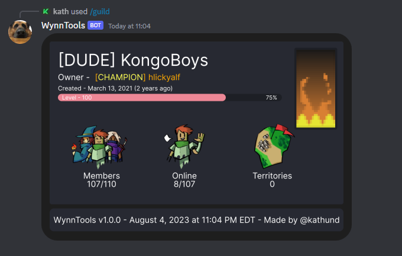              |
| report-bug            | Report a bug to the dev.                                           | `/report-bug`                                                        | `/report-bug`                                               | 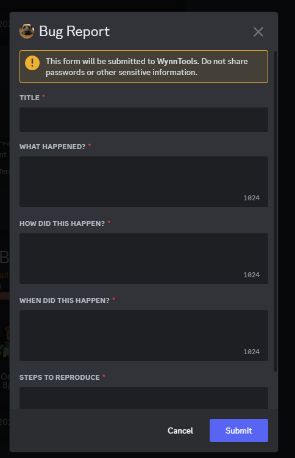          |
| stats                 | Display Stats about a user.                                        | `/stats <player>`                                                    | `/stats Udderly_Cool`                                       | 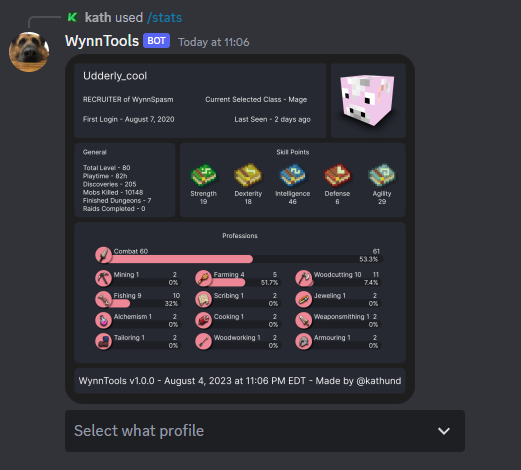              |
| user                  | Shows info about you or a selected user.                           | `/user [discord-user]`                                               | `/user`                                                     | 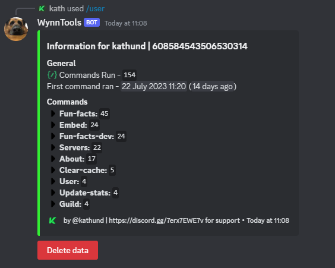               |

#### Locked Dev commands

| Command               | Description                                          | Syntax                                    | Example                                                               | Response                                          |
| --------------------- | ---------------------------------------------------- | ----------------------------------------- | --------------------------------------------------------------------- | ------------------------------------------------- |
| blacklist add         | Add a user to blacklist.                             | `/blacklist add <discord-id>`             | `/blacklist add 608584543506530314`                                   | 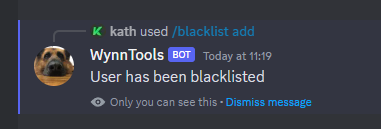    |
| blacklist remove      | Remove a user to blacklist.                          | `/blacklist remove <discord-id>`          | `/blacklist remove 608584543506530314`                                | 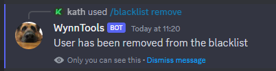 |
| clear-cache           | Clear Cache.                                         | `/clear-cache <cache-type>`               | `/clear-cache Mojang`                                                 | 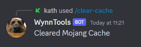      |
| embed edit            | Edit an embed to a new embed.                        | `/embed edit <message-link> <embed-link>` | `/embed edit https://discord.com/xxxx/xxxx https://starb.in/xxx.json` |                 |
| embed send            | Send an embed.                                       | `/embed send <embed-link> <channel>`      | `/embed send https://starb.in/xxx.json funny-channel-name`            |                 |
| embed source          | Returns the starb.in link of a given embed.          | `/embed source <message-link>`            | `/embed source https://discord.com/xxxx/xxxx`                         |                 |
| fun-facts-dev approve | Approve a fun fact .                                 | `/fun-facts-dev approve <id>`             | `/fun-facts-dev approve 1`                                            |                 |
| fun-facts-dev configs | View the configs for fun facts.                      | `/fun-facts-dev configs [server-id]`      | `/fun-facts-dev configs`                                              |                 |
| fun-facts-dev delete  | Delete a fun fact.                                   | `/fun-facts-dev delete <type> <id>`       | `/fun-facts-dev delete 2`                                             |                 |
| fun-facts-dev deny    | Deny a fun fact.                                     | `/fun-facts-dev deny <id>`                | `/fun-facts-dev deny 1`                                               |                 |
| fun-facts-dev list    | Generate a list of all fun facts or all suggestions. | `/fun-facts-dev list <type>`              | `/fun-facts-dev list facts`                                           |                 |
| fun-facts-dev view    | View a fun fact.                                     | `/fun-facts-dev view <type> <id>`         | `/fun-facts-dev view facts 1`                                         |                 |

## Change Log

### v1.0.0 🎉🎉

- With the release of v1.0.0 its the full public release of WynnTools.

## Credits

- [WynnCraft API](https://docs.wynncraft.com/)
- [Pixelic API](https://api.pixelic.de/)
